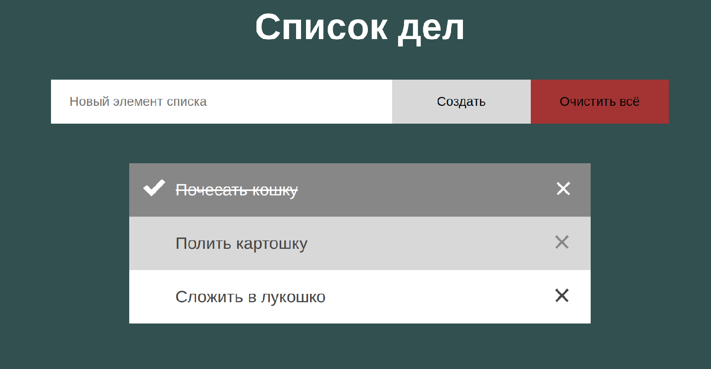
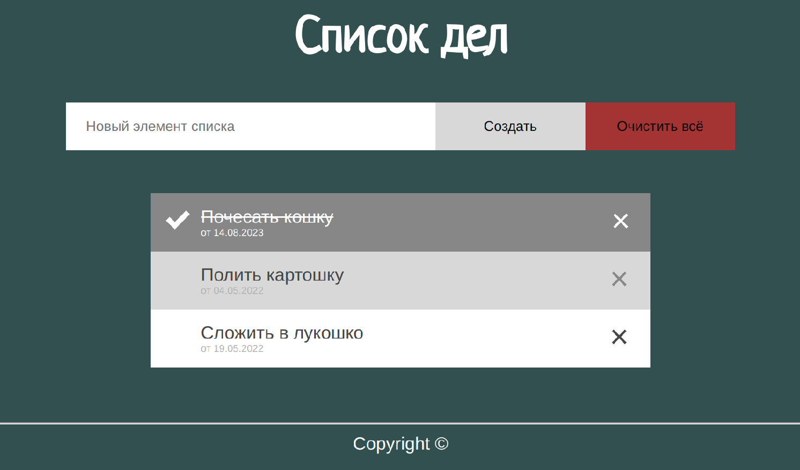
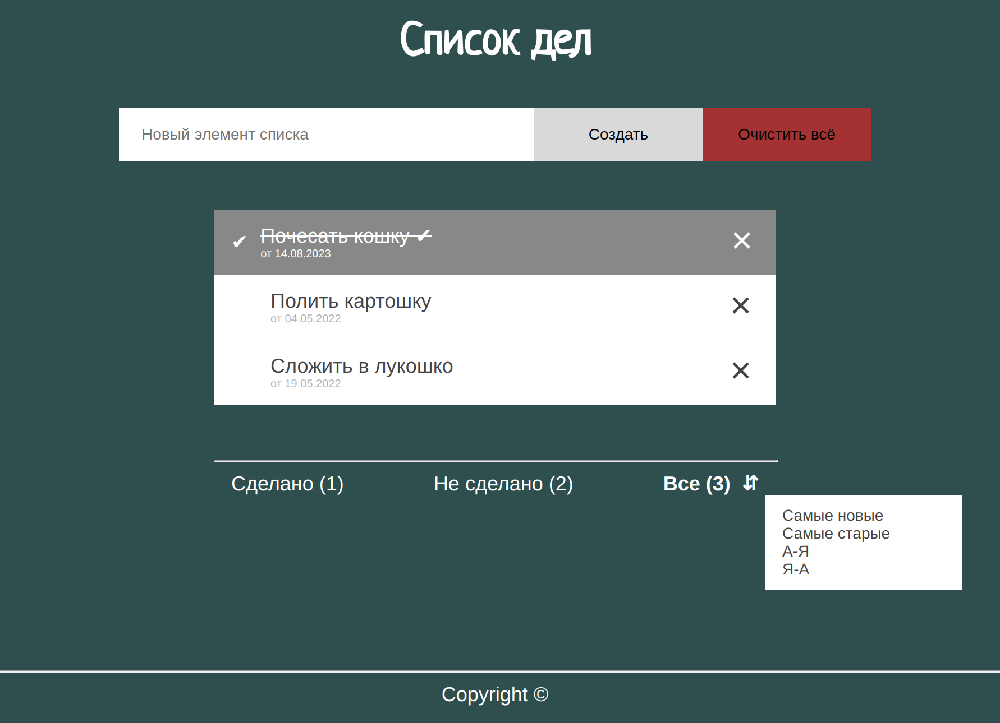

# Группы 107а, 107б, 107в, 107г, etc...
 
# Программа курса

* [Лекция 1. CSS для продолжающих: блочная верстка (grid, flex), анимация]()
* [Лекции 2-4. JavaScript](https://dmitryweiner.github.io/web-lectures/Basic%20-%20JS.html)
    * [Лекция 2. Генераторы. Map, Set. Даты. Работа с устройствами.](https://dmitryweiner.github.io/web-lectures/JS_part6.html)
    * [Лекция 3. Работа с DOM. События. Local Storage & Cookies](https://dmitryweiner.github.io/web-lectures/JS_part4.html)
    * [Лекция 4. Асинхронный код. Обработка ошибок. HTTP-запросы](https://dmitryweiner.github.io/web-lectures/JS_part5.html)
* [Лекция 5. Node.js](https://dmitryweiner.github.io/web-lectures/Basic%20-%20Nodejs.html)
* [Лекция 5. NPM](https://dmitryweiner.github.io/web-lectures/Basic%20-%20NPM.html)
* [Лекция 6. Webpack](https://dmitryweiner.github.io/web-lectures/Basic%20-%20Webpack.html)
* [Лекция 7. TypeScript](https://dmitryweiner.github.io/web-lectures/Basic%20-%20TypeScript.html)
* [Лекции 8-12. React.js]()
   * [Лекция 8. Введение во фреймворк React.js](https://dmitryweiner.github.io/web-lectures/React%20-%20Basic.html)
   * [Лекция 8. Стили и картинки](https://dmitryweiner.github.io/web-lectures/React%20-%20Styles%20and%20assets.html#/)
   * [Лекция 9. Функциональные компоненты и хуки](https://dmitryweiner.github.io/web-lectures/React%20-%20Hooks.html)
   * [Лекция 10. Запросы в сеть. Fetch](https://dmitryweiner.github.io/web-lectures/React%20-%20Network.html)
   * [Лекция 10. Запросы в сеть. React Query](https://dmitryweiner.github.io/web-lectures/React%20-%20Query.html)
   * [Лекция 10. Маршрутизация](https://dmitryweiner.github.io/web-lectures/React%20-%20Router.html)
   * [Лекция 11. Как работать с формами и контролами](https://dmitryweiner.github.io/web-lectures/React%20-%20Form%20controls.html)
   * [Лекция 11. Валидация форм](https://dmitryweiner.github.io/web-lectures/React%20-%20Form%20controls.html)
   * [Лекция 12. TypeScript + React](https://dmitryweiner.github.io/web-lectures/React%20-%20TypeScript%20with%20React.html)
* [Лекция 13. Тестирование с помощью testing-library](https://dmitryweiner.github.io/web-lectures/React%20-%20Testing%20components.html)
* [Лекция 13. Тестирование запросов в сеть](https://dmitryweiner.github.io/web-lectures/React%20-%20Fetch.html)
* [Лекция 14. ESLint + Prettier + Husky](https://github.com/dmitryweiner/web-lectures/raw/main/old/%D0%9B%D0%B5%D0%BA%D1%86%D0%B8%D1%8F%20eslint%20prettier%20husky.pptx)
* [Лекция 15. Node.js + SQLite](https://dmitryweiner.github.io/web-lectures/SQLite.html)
* [Лекция 16. Git](https://dmitryweiner.github.io/web-lectures/Basic%20-%20Git.html)
* [Лекция 16. Как выкладывать сайт в интернет](https://dmitryweiner.github.io/web-lectures/Deploy.html#/)
* Лекция 17. Основные принципы дизайна + CSS-препроцессоры
* Лекция 18. Другие фреймворки
* [Лекция 19. Библиотеки готовых компонентов](https://dmitryweiner.github.io/web-lectures/React%20-%20Component%20libraries.html)

# Лабораторные

### [1. CSS](src/lab_2_css.md)

* Написать стили для веб-приложения (раскрасить в указанные цвета и подключить шрифты стандартные либо от GoogleFonts).
* Фон элементов списка должен меняться при наведении, иконки перекрашиваться, чтобы оставаться различимыми 
* Постараться отцентрировать весь блок горизонтально и вертикально.
* Добиться, чтобы при сужении окна кнопки "Добавить" и "Очистить всё" уходили под поле ввода текста. То же самое нужно будет проделать с режимами фильтрации, которые пригодятся позже.
* Будет плюсом, если сам список можно будет прокручивать без прокручивания самой страницы.
* Отображать фразу "Не найдено ни одного дела" строго по центру страницы для случая отсутствия элементов списка
* В процессе можно пользоваться [презентацией](https://dmitryweiner.github.io/web-lectures/Basic%20-%20CSS.html).
* Результат коммитить в тот же проект, что и предыдущее задание.

  Опционально:
  
* Использовать декоративный шрифт для заголовка.
* Зафиксировать футер статично внизу, чтобы при уменьшении размера окна он оставался на месте, а менялся лишь размер средней части со списком (заголовок и добавление элементов тоже были на месте).
* У дат сделать небольшой размер шрифта, покрасить в светло-серый и разместить их под лейблами.
* Добавить фоновое изображение и адаптировать его в зависимости от разрешения (медийные запросы о параметрах устройства),
* Сделать составной заголовок (картинка + текст) и проконтролировать, что страница всё ещё корректно себя ведёт при изменении размеров экрана
* Использовать css-модули, задание цветов и размеров через переменные, вложенную структуру селекторов (scss)

Итог будет выглядеть вот так:

* ? Придумать на transition и анимацию (прозрачности?)

---

### [2. JavaScript: генераторы, математика, Map и Set](https://github.com/goryachkinama/web-lectures/blob/main/src/lab_4_js_maths.md)

* Задача 1
* Задача 2

* ? Ещё из решения задач

---

### [3. Оживляем список дел: прикручиваем JS](src/lab_6_js_todo_list.md)

* Реализовать возможность добавления новых элементов.
* Реализовать возможность удаления элементов.
* Построить оптимальную архитектуру: разделить отображение элементов и хранение элементов.
* Сделать нажимаемыми ссылки внизу (нажимаешь, она становится жирной). Ссылки определяют режим фильтрации (все, сделанные, не сделанные).
* Сделать фильтрацию списка в соответствии с выбранным режимом.
* Добавить возможность сортировки по наименованию записи.

  Опционально:

* Сохранять элементы в [localstorage](https://learn.javascript.ru/localstorage).
* Реализовать возможность редактирования элементов.
* Сортировка по дате создания записи.

---

### 4. JavaScript: асинхронность, решение задач

[Часть 1. JavaScript и асинхронный код](src/lab_5_js_async.md)

* Задача 1
* Задача 2
* Задача 3

[Часть 2. Решение задач](src/lab_5_js.md)

* ? 10 задач, мб рассортировать

---

### 5. NodeJS и NPM

[Часть 1. NodeJS](src/lab_7_nodejs.md)

* Задача 1
* Задача 2
* Задача 3

[Часть 2. NPM](src/lab_7_npm.md)

* Задача 1
* Задача 2

---

### [6. Настройка инфраструктуры. Сборка проекта и установка зависимостей](src/lab_7_webpack.md)

* Добавить в проект TODO-list файл package.json
* Поставить Webpack и создать webpack.config.js
* Прописать скрипты для старта и сборки проекта

Опционально:

* Сделать разные Webpack-конфиги для продакшена и для разработки
* Настроить минификацию JS и CSS
* При запуске веб-сервера открывать окно браузера
* Потренироваться на задачах по NodeJS и NPM

---

### [7. TypeScript](src/lab_8_ts.md)

* Задания и упражнения по TypeScript
* Переписать TODO-list на Typescript

---

### [8. React: настройка и "Hello world"](src/lab_9_react.md)

* Подключение и настройка работы с библиотекой
* Задания и упражнения по React
* ? Что-то добавить про картинки и стили
  
---

### [9. React: функциональные компоненты и хуки](src/lab_10_react_hooks.md)

* Задания (5 штук)

---

### [10. React: запросы в сеть](src/lab_react_network.md)

* Задания на fetch
* Задания на React.query
* Задания на маршрутизацию

---

### [11. React: формы, контролы, валидация](src/lab_react_forms.md)

* Задание 1 на формы
* Задание 2 на валидацию

---

### 12. React + Typescript:

* TODO-list на React

---

### 13. Тестирование: react-testing-library

* Какие-нибудь тесты написать

---
