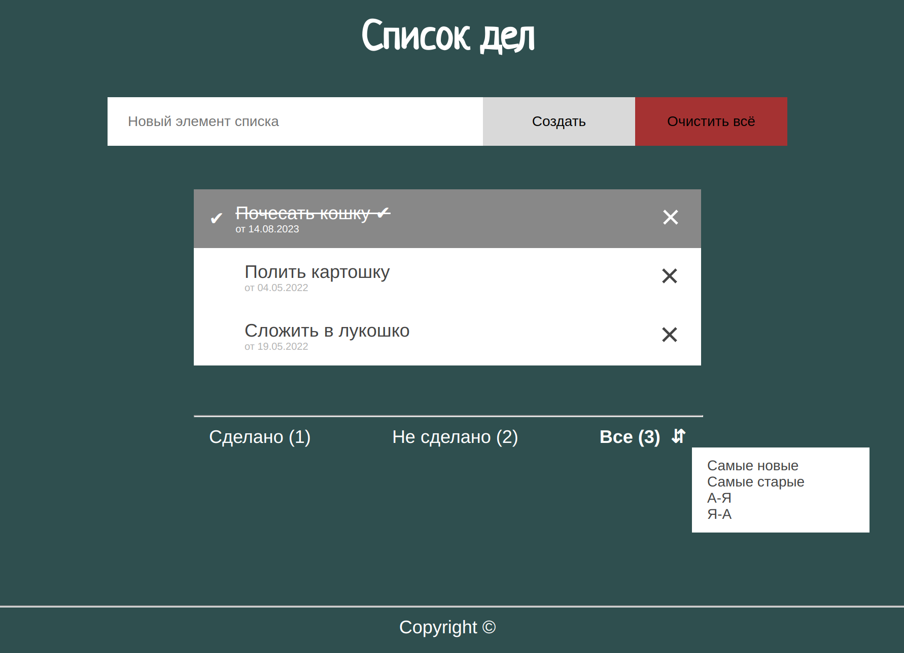

# Группы 007в, 007г
# Программа курса

* [HTML](https://dmitryweiner.github.io/web-lectures/Basic%20-%20HTML.html)
* [CSS](https://dmitryweiner.github.io/web-lectures/Basic%20-%20CSS.html)
* [JavaScript](https://dmitryweiner.github.io/web-lectures/Basic%20-%20JS.html)
    * [Введение в язык JavaScript. Основы языка: синтаксис, управляющие конструкции.](https://dmitryweiner.github.io/web-lectures/JS_part1.html)
    * [Функции. Rest...spread.](https://dmitryweiner.github.io/web-lectures/JS_part2.html)
    * [Массивы.](https://dmitryweiner.github.io/web-lectures/JS_part3.html)
    * [Работа с DOM. События.](https://dmitryweiner.github.io/web-lectures/JS_part4.html)
    * [Асинхронный код. Обработка ошибок. HTTP-запросы.](https://dmitryweiner.github.io/web-lectures/JS_part5.html)
    * [Map, Set. Даты. Работа с устройствами.](https://dmitryweiner.github.io/web-lectures/JS_part6.html)
* [Node.js](https://dmitryweiner.github.io/web-lectures/Basic%20-%20Nodejs.html)
* [NPM](https://dmitryweiner.github.io/web-lectures/Basic%20-%20NPM.html)
* [Webpack](https://dmitryweiner.github.io/web-lectures/Basic%20-%20Webpack.html#/)
* [TypeScript](https://dmitryweiner.github.io/web-lectures/Basic%20-%20TypeScript.html)
* [Введение во фреймворк React.js](https://dmitryweiner.github.io/web-lectures/React%20-%20Basic.html#/)
  * [Функциональные компоненты и хуки](https://dmitryweiner.github.io/web-lectures/React%20-%20Hooks.html#/)
  * [Как работать с формами и контролами](https://dmitryweiner.github.io/web-lectures/React%20-%20Form%20controls.html#/)
  * [Запросы в сеть](https://dmitryweiner.github.io/web-lectures/React%20-%20Fetch.html#/)
  * [TypeScript + React](https://dmitryweiner.github.io/web-lectures/React%20-%20TypeScript%20with%20React.html#/)
* [Тестирование с помощью testing-library](https://dmitryweiner.github.io/web-lectures/React%20-%20Testing%20components.html#/)
* [ESLint + Prettier + Husky](https://github.com/dmitryweiner/web-lectures/raw/main/old/%D0%9B%D0%B5%D0%BA%D1%86%D0%B8%D1%8F%20eslint%20prettier%20husky.pptx)
* [Git](https://dmitryweiner.github.io/web-lectures/Basic%20-%20Git.html)

# Лабораторные

### 1. HTML

* Сверстать заготовку (некликабельный макет) будущего веб-приложения.
* Проследить, что title страницы не пустой
* Добавить favicon (картинка, отображающаяся на вкладке рядом с title'ом)
* В процессе можно пользоваться [презентацией](https://dmitryweiner.github.io/web-lectures/Basic%20-%20HTML.html#/).
* Результат закоммитить на гитхаб и прислать ссылку на проект.

Опционально:
* Добавить футер (линия и Copyright ©), который пригодится при работе со стилями
* Добавить возле названия дату добавления элемента списка верхним либо нижним индексом, по ней будем сортировать
* Придумать и прописать универсальный атрибут "class" для основных элементов страницы (кнопки, заголовки, лейблы и пр., на что будут вешаться стили)

Итог будет выглядеть вот так:

---

### 2. CSS

* Написать стили для веб-приложения (раскрасить в указанные цвета и подключить шрифты стандартные либо от GoogleFonts).
* Фон элементов списка должен меняться при наведении, иконки перекрашиваться, чтобы оставаться различимыми 
* Постараться отцентрировать весь блок горизонтально и вертикально.
* Добиться, чтобы при сужении окна кнопки "Добавить" и "Очистить всё" уходили под поле ввода текста. То же самое нужно будет проделать с режимами фильтрации, которые пригодятся позже.
* Будет плюсом, если сам список можно будет прокручивать без прокручивания самой страницы.
* Отображать фразу "Не найдено ни одного дела" строго по центру страницы для случая отсутствия элементов списка
* В процессе можно пользоваться [презентацией](https://dmitryweiner.github.io/web-lectures/Basic%20-%20CSS.html#/).
* Результат коммитить в тот же проект, что и предыдущее задание.

  Опционально:
* Использовать декоративный шрифт для заголовка.
* Зафиксировать футер статично внизу, чтобы при уменьшении размера окна он оставался на месте, а менялся лишь размер средней части со списком (заголовок и добавление элементов тоже были на месте).
* У дат сделать небольшой размер шрифта, покрасить в светло-серый и разместить их под лейблами.
* Добавить фоновое изображение и адаптировать его в зависимости от разрешения (медийные запросы о параметрах устройства),
* Сделать составной заголовок (картинка + текст) и проконтролировать, что страница всё ещё корректно себя ведёт при изменении размеров экрана
* Использовать css-модули, задание цветов и размеров через переменные, вложенную структуру селекторов (scss)

Итог будет выглядеть вот так:

---

### 3. Оживляем список дел: прикручиваем JS

* Реализовать возможность добавления новых элементов.
* Реализовать возможность удаления элементов.
* Построить оптимальную архитектуру: разделить отображение элементов и хранение элементов.
* Опционально: Сохранить элементы в [localstorage](https://learn.javascript.ru/localstorage).

---

### 4. Фильтрация и сортировка элементов

* Сделать нажимаемыми ссылки внизу (нажимаешь, она становится жирной). Ссылки определяют режим фильтрации (все, сделанные, не сделанные).
* Сделать фильтрацию списка в соответствии с выбранным режимом.
* Добавить возможность сортировки по дате создания

---

