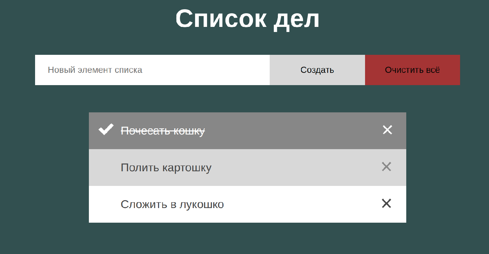
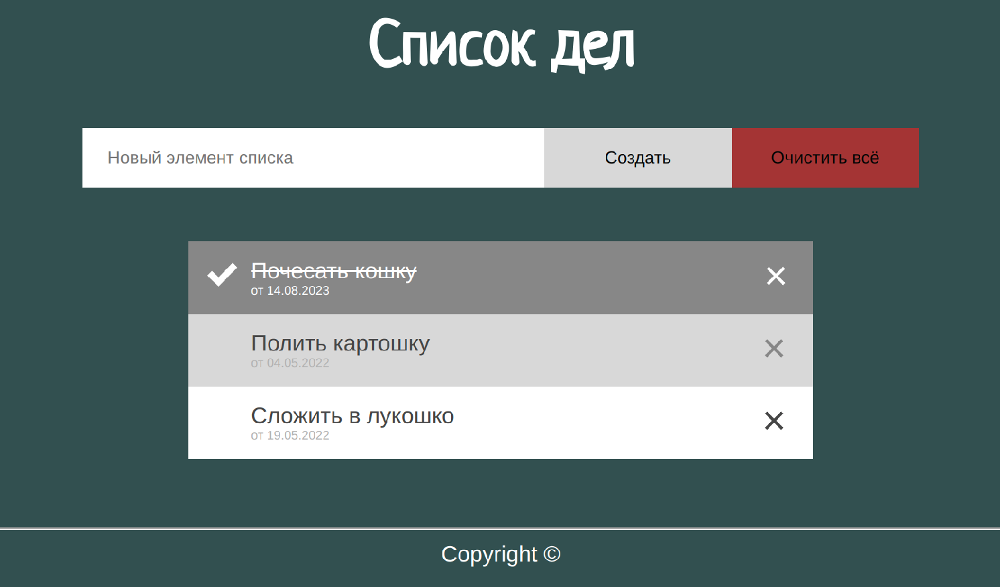

# Группы 007в, 007г
# Программа курса

* [Лекция 1. HTML](https://dmitryweiner.github.io/web-lectures/Basic%20-%20HTML.html)
* [Лекция 2. CSS](https://dmitryweiner.github.io/web-lectures/Basic%20-%20CSS.html)
* [Лекции 3-5. JavaScript](https://dmitryweiner.github.io/web-lectures/Basic%20-%20JS.html)
    * [Лекция 3. Введение в язык JavaScript. Основы языка: синтаксис, управляющие конструкции.](https://dmitryweiner.github.io/web-lectures/JS_part1.html)
    * [Лекция 3. Функции. Rest...spread.](https://dmitryweiner.github.io/web-lectures/JS_part2.html)
    * [Лекция 4. Массивы.](https://dmitryweiner.github.io/web-lectures/JS_part3.html)
    * [Лекция 4. Map, Set. Даты. Работа с устройствами.](https://dmitryweiner.github.io/web-lectures/JS_part6.html)
    * [Лекция 5. Работа с DOM. События.](https://dmitryweiner.github.io/web-lectures/JS_part4.html)
    * [Лекция 5. Асинхронный код. Обработка ошибок. HTTP-запросы.](https://dmitryweiner.github.io/web-lectures/JS_part5.html)
* [Лекция 6. Node.js](https://dmitryweiner.github.io/web-lectures/Basic%20-%20Nodejs.html)
* [Лекция 6. NPM](https://dmitryweiner.github.io/web-lectures/Basic%20-%20NPM.html)
* [Лекция 7. Webpack](https://dmitryweiner.github.io/web-lectures/Basic%20-%20Webpack.html)
* [Лекция 8. TypeScript](https://dmitryweiner.github.io/web-lectures/Basic%20-%20TypeScript.html)
* [Лекции 9-12. React.js]()
   * [Лекция 9. Введение во фреймворк React.js](https://dmitryweiner.github.io/web-lectures/React%20-%20Basic.html)
   * [Лекция 10. Функциональные компоненты и хуки](https://dmitryweiner.github.io/web-lectures/React%20-%20Hooks.html)
   * [Лекция 11. Запросы в сеть. ](https://dmitryweiner.github.io/web-lectures/React%20-%20Fetch.html)[Fetch](https://dmitryweiner.github.io/web-lectures/React%20-%20Network.html)
   * [Лекция 11. Запросы в сеть. React Query](https://dmitryweiner.github.io/web-lectures/React%20-%20Query.html)
   * [Лекция 12. Как работать с формами и контролами](https://dmitryweiner.github.io/web-lectures/React%20-%20Form%20controls.html)
   * [Лекция 12. TypeScript + React](https://dmitryweiner.github.io/web-lectures/React%20-%20TypeScript%20with%20React.html)
* [Лекция 13. Тестирование с помощью testing-library](https://dmitryweiner.github.io/web-lectures/React%20-%20Testing%20components.html)
* [Лекция 14. ESLint + Prettier + Husky](https://github.com/dmitryweiner/web-lectures/raw/main/old/%D0%9B%D0%B5%D0%BA%D1%86%D0%B8%D1%8F%20eslint%20prettier%20husky.pptx)
* [Лекция 15. Node.js + SQLite](https://dmitryweiner.github.io/web-lectures/SQLite.html)
* [*Git](https://dmitryweiner.github.io/web-lectures/Basic%20-%20Git.html)
* [* Как выкладывать сайт в интернет](https://dmitryweiner.github.io/web-lectures/Deploy.html#/)
* *Основные принципы дизайна + CSS-препроцессоры

# Лабораторные

### [1. HTML](src/lab_1_html.md)

* Сверстать заготовку (некликабельный макет) будущего веб-приложения.
* Проследить, что title страницы не пустой
* Добавить favicon (картинка, отображающаяся на вкладке рядом с title'ом)
* В процессе можно пользоваться [презентацией](https://dmitryweiner.github.io/web-lectures/Basic%20-%20HTML.html).
* Результат закоммитить на гитхаб и прислать ссылку на проект.

Опционально:
* Добавить футер (линия и Copyright ©), который пригодится при работе со стилями
* Добавить возле названия дату добавления элемента списка верхним либо нижним индексом, по ней будем сортировать
* Придумать и прописать универсальный атрибут "class" для основных элементов страницы (кнопки, заголовки, лейблы и пр., на что будут вешаться стили)

Итог будет выглядеть вот так:

---

### [2. CSS](src/lab_2_css.md)

* Написать стили для веб-приложения (раскрасить в указанные цвета и подключить шрифты стандартные либо от GoogleFonts).
* Фон элементов списка должен меняться при наведении, иконки перекрашиваться, чтобы оставаться различимыми 
* Постараться отцентрировать весь блок горизонтально и вертикально.
* Добиться, чтобы при сужении окна кнопки "Добавить" и "Очистить всё" уходили под поле ввода текста. То же самое нужно будет проделать с режимами фильтрации, которые пригодятся позже.
* Будет плюсом, если сам список можно будет прокручивать без прокручивания самой страницы.
* Отображать фразу "Не найдено ни одного дела" строго по центру страницы для случая отсутствия элементов списка
* В процессе можно пользоваться [презентацией](https://dmitryweiner.github.io/web-lectures/Basic%20-%20CSS.html).
* Результат коммитить в тот же проект, что и предыдущее задание.

  Опционально:
  
* Использовать декоративный шрифт для заголовка.
* Зафиксировать футер статично внизу, чтобы при уменьшении размера окна он оставался на месте, а менялся лишь размер средней части со списком (заголовок и добавление элементов тоже были на месте).
* У дат сделать небольшой размер шрифта, покрасить в светло-серый и разместить их под лейблами.
* Добавить фоновое изображение и адаптировать его в зависимости от разрешения (медийные запросы о параметрах устройства),
* Сделать составной заголовок (картинка + текст) и проконтролировать, что страница всё ещё корректно себя ведёт при изменении размеров экрана
* Использовать css-модули, задание цветов и размеров через переменные, вложенную структуру селекторов (scss)

Итог будет выглядеть вот так:

---

### 3. JavaScript: введение в синтаксис, функции

[Часть 1. Введение в синтаксис:](src/lab_3_js_about.md)

* Задание 1. Работа с переменными
* Задание 2. Исправьте сложение
* Задание 3. Выведите чётные числа
* Задание 4. Замените for на while
* Задание 5. Повторять цикл, пока ввод неверен
* Задание 6. Простые числа

[Часть 2. Функции:](src/lab_3_js_func.md)

* Задача 1
* Задача 2

---

### 4. JavaScript: массивы, генераторы

[Часть 1. Массивы:](https://github.com/goryachkinama/web-lectures/blob/main/src/lab_4_js_arr.md)

* Задача 1
* Задача 2
* Задача 3

[Часть 2. Генераторы, математика, Map и Set в JavaScript:](https://github.com/goryachkinama/web-lectures/blob/main/src/lab_4_js_maths.md)

* Задача 1
* Задача 2

---

### 5. JavaScript: асинхронность, решение задач

[Часть 1. JavaScript и асинхронный код](https://github.com/goryachkinama/web-lectures/blob/main/src/lab_5_js_async.md)

* Задача 1
* Задача 2
* Задача 3

[Часть 2. Решение задач](https://github.com/goryachkinama/web-lectures/blob/main/src/lab_5_js.md)

* 10 задач

---

### [6. Оживляем список дел: прикручиваем JS](src/lab_6_js_todo_list.md)

* Реализовать возможность добавления новых элементов.
* Реализовать возможность удаления элементов.
* Построить оптимальную архитектуру: разделить отображение элементов и хранение элементов.
* Сделать нажимаемыми ссылки внизу (нажимаешь, она становится жирной). Ссылки определяют режим фильтрации (все, сделанные, не сделанные).
* Сделать фильтрацию списка в соответствии с выбранным режимом.
* Добавить возможность сортировки по наименованию записи.

  Опционально:

* Сохранять элементы в [localstorage](https://learn.javascript.ru/localstorage).
* Реализовать возможность редактирования элементов.
* Сортировка по дате создания записи.

---

### [7. Настройка инфраструктуры. Сборка проекта и установка зависимостей](src/lab_7_webpack.md)

* Добавить в проект TODO-list файл package.json
* Поставить Webpack и создать webpack.config.js
* Прописать скрипты для старта и сборки проекта

Опционально:

* Сделать разные Webpack-конфиги для продакшена и для разработки
* Настроить минификацию JS и CSS
* При запуске веб-сервера открывать окно браузера
* Потренироваться на задачах по NodeJS и NPM

---

### [8. TypeScript](src/lab_8_ts.md)

* Задания и упражнения по TypeScript
* Переписать TODO-list на Typescript

---

### [9. React: настройка и "Hello world"](src/lab_9_react.md)

* Подключение и настройка работы с библиотекой
* Задания и упражнения по React
  
---

### [10. React: функциональные компоненты и хуки](src/lab_10_react_hooks.md)

* Задания

---

### 11. React + Typescript:

* TODO-list на React

---
