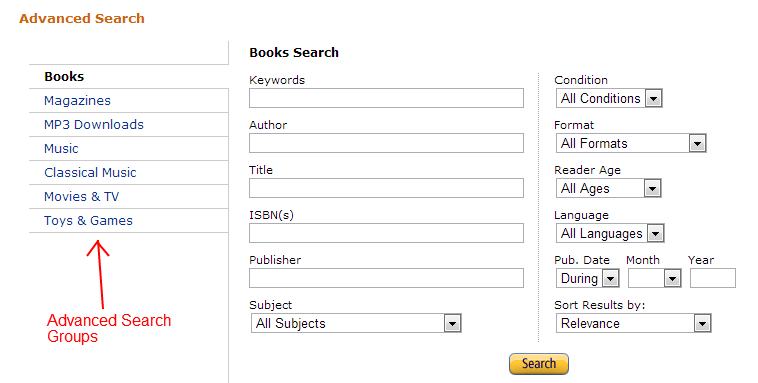

# Работа с API

### а) Выбрать себе API по вкусу:

* [Список интересных API](https://github.com/public-apis/public-apis),
* [7 публичных API](https://proglib.io/p/7-besplatnyh-api-o-kotoryh-nikto-ne-govorit-2020-12-07?focus=comment)
* Проверенные:
    * [Google Books](https://www.googleapis.com/books/v1/volumes?maxResults=5&orderBy=relevance&q=oliver%20sacks).
    * [Погода по названию города](https://goweather.herokuapp.com/weather/Curitiba).
    * [Погода по координатам](https://api.open-meteo.com/v1/forecast?latitude=52.52&longitude=13.41&hourly=temperature_2m,relativehumidity_2m,windspeed_10m).
    * [arXive](http://export.arxiv.org/api/query?search_query=all:electron&start=0&max_results=1).
    * [Орбиты спутников в космосе](https://tle.ivanstanojevic.me/#/browse).
    * [Землетрясения](https://earthquake.usgs.gov/fdsnws/event/1/).
    * [Координаты самолётов (и не только)](https://openskynetwork.github.io/opensky-api/rest.html).
    * [Поиск городов](http://geodb-cities-api.wirefreethought.com/demo).
    * [Еда](https://api.edamam.com/search?app_id=900da95e&app_key=40698503668e0bb3897581f4766d77f9&q=tomato).
    * [Динозавры](https://paleobiodb.org/data1.2/occs_doc.html).
    * [Fake users](https://randomuser.me/documentation).
    * [NASA](https://api.nasa.gov/).
    * [Покемоны](https://pokeapi.co/).
    * [Чат](https://github.com/dmitryweiner/mini-chat-server).
    * [TODO list](https://github.com/dmitryweiner/todo-server).
    * НСКГорТранс:
        * [Список маршрутов](https://map.nskgortrans.ru/listmarsh.php?r=&r=true).
        * [Информация по 23-му автобусу](https://map.nskgortrans.ru/markers.php?r=1-023-W-23%257C)
    * [VK](https://dev.vk.com/api/getting-started).
    * [HeadHunter](https://github.com/hhru/api).
    * [Dadata](https://dadata.ru/api/).
    * [Поиск мест по запросу](https://nominatim.org/release-docs/develop/api/Search/).
    * [Самодельное API городов](https://github.com/dmitryweiner/cities-api).

### б) Реализовать форму ввода (поиск?), кнопку "отправить" и отображение результатов.

* При отправке должен отображаться спиннер, который исчезает при получении результатов.
* Типовой вид формы:
  

### в) Реализовать дополнительные фичи:

* Сортировку по какому-либо полю.
* Фильтрация по категории.
* Ограничение количества результатов на странице.
* Типовой вид формы:

