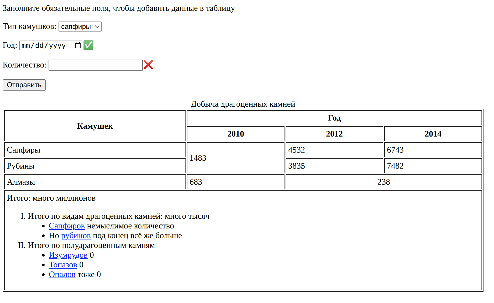

# Лабораторная 1. HTML

### [Презентация по HTML](https://dmitryweiner.github.io/web-lectures/Basic%20-%20HTML.html)

### Обязательная часть 

* Сверстать некликабельный макет следующего содержания
* В процессе можно пользоваться [презентацией](https://dmitryweiner.github.io/web-lectures/Basic%20-%20HTML.html#/).
* Результат закоммитить на гитхаб и прислать ссылку на проект.

---
