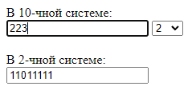

# Лабораторная. . Конвертер систем счисления

* Написать приложение для конвертирования между системами счисления.
* При вводе в верхнее поле в нижнем отображается сконвертированное число (в соответствии с тем, что выбрано в селектбоксе).
* При вводе в нижнее поле обновляется верхнее.
* При изменении селектбокса изменяется только нижнее.

---

