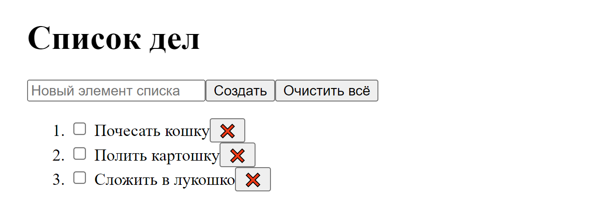
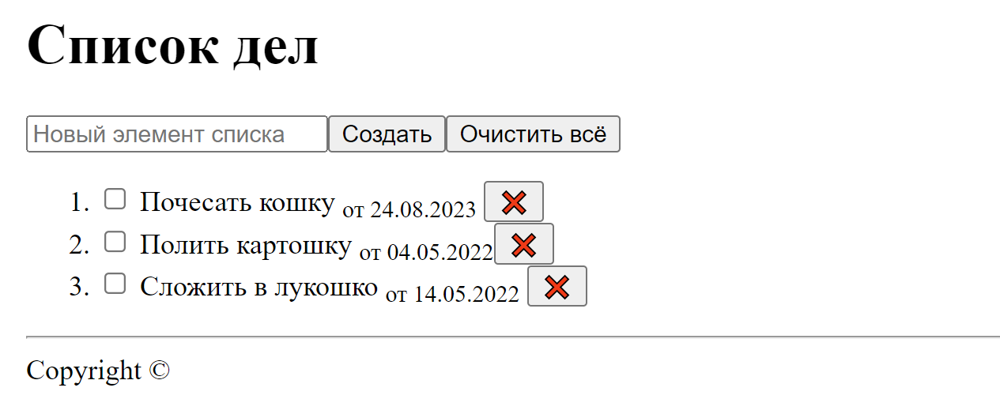

# Лабораторная 1. HTML

### Обязательная часть 

* Сверстать заготовку (некликабельный макет) будущего веб-приложения.
* Проследить, что title страницы не пустой
* Добавить favicon (картинка, отображающаяся на вкладке рядом с title'ом)
* В процессе можно пользоваться [презентацией](https://dmitryweiner.github.io/web-lectures/Basic%20-%20HTML.html#/).
* Результат закоммитить на гитхаб и прислать ссылку на проект.

---

### Опциональная

* Добавить футер (линия и Copyright ©), который пригодится при работе со стилями
* Добавить возле названия дату добавления элемента списка верхним либо нижним индексом, по ней будем сортировать
* Придумать и прописать универсальный атрибут "class" для основных элементов страницы (кнопки, заголовки, лейблы и пр., на что будут вешаться стили)

Итог будет выглядеть вот так:

---