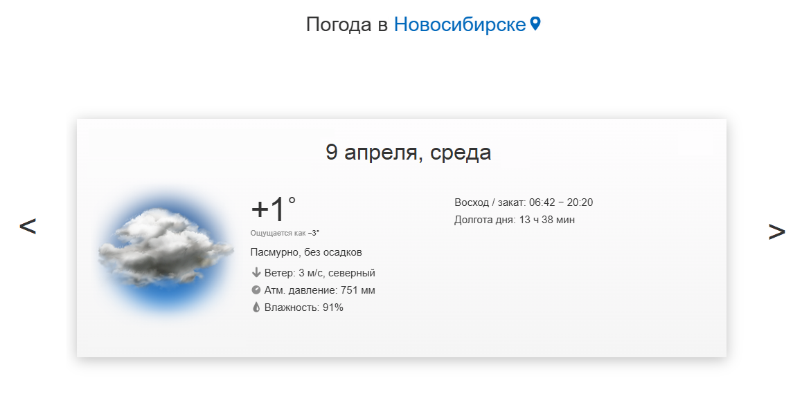

# Лабораторная. Прогноз погоды

### [Презентация по CSS](https://dmitryweiner.github.io/web-lectures/Basic%20-%20CSS.html)
### [Запросы в сеть](https://dmitryweiner.github.io/web-lectures/JS_part5.html#/29)
### [Javascript и работа с DOM. События](https://dmitryweiner.github.io/web-lectures/JS_part4.html#/)
#### [Работа с DOM](https://dmitryweiner.github.io/web-lectures/JS_part4.html#/1)
#### [События и обработчики](https://dmitryweiner.github.io/web-lectures/JS_part4.html#/15)

---

### Задание

* Найти API, который выдает прогноз погоды на день
* Сделать html-страницу с подробным прогнозом, который отображается в виде карусельки (стрелками перематываем дни либо время дня)

